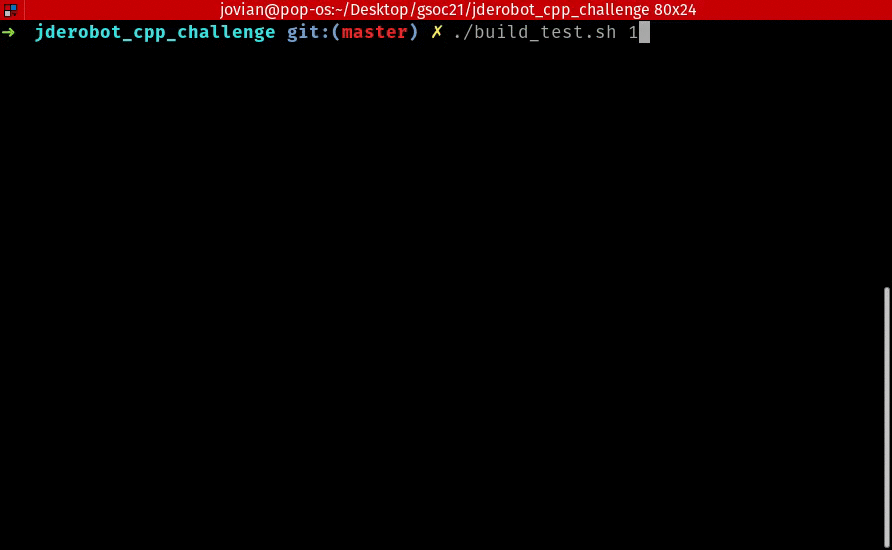

# JdeRobot CPP Challenge 2021



## Description
This solution uses Backtracking to compute the longest path in the labyrinth 


## Building and Running the solution
```bash
# Build the solution
rm -rf build
mkdir build && cd build
cmake ..
make

# Running on test Example
./labyrinth ../test/input1.txt ../test/output1.txt
```
## Building and Testing using scripts

```bash
./build_test.sh <test_number>
```


